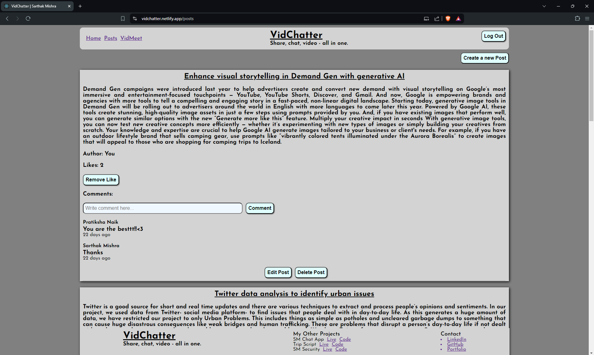
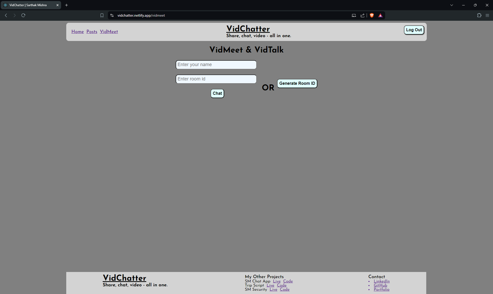
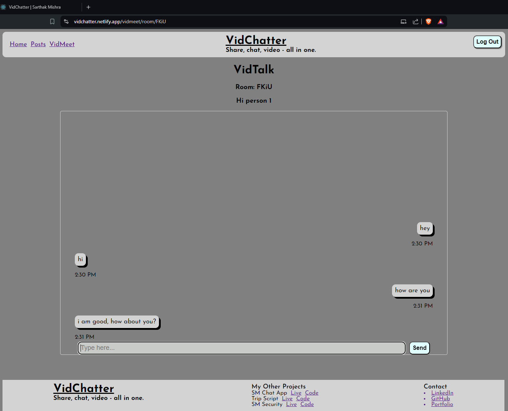
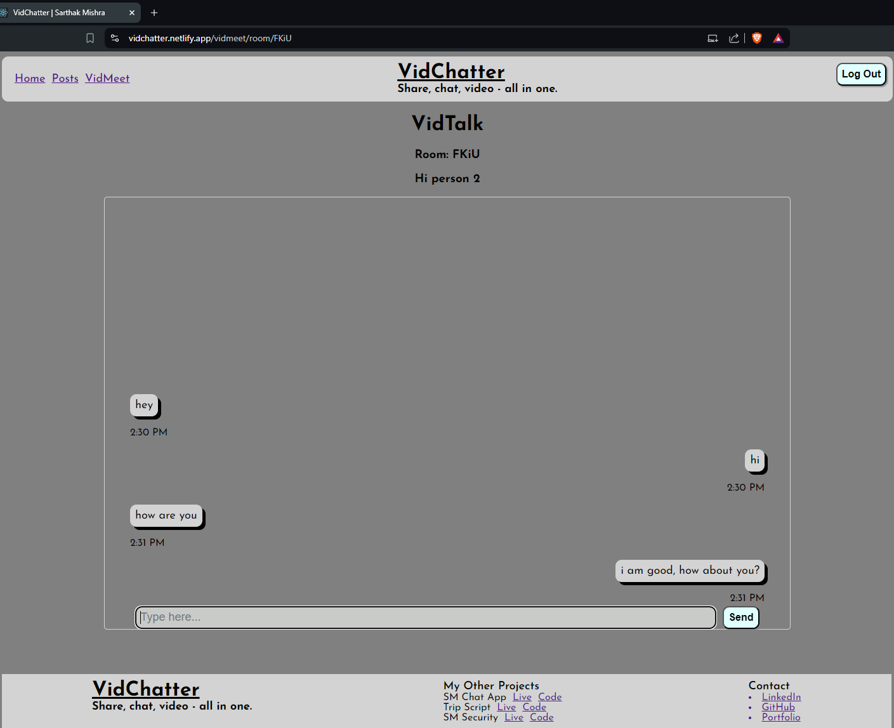

# VidChatter (Share, chat, video - all in one.)

VidChatter is a dynamic web application designed for seamless social interaction. It combines a robust posting system, real-time chat functionality, and one-on-one video calling to provide a comprehensive social media experience. Built using ReactJS (TypeScript) for the front end and ExpressJS for the backend, VidChatter offers a modern, responsive, and interactive user experience.

## Key Features
- **Posts**: Create, read, update, and delete posts. Users can share their thoughts and engage with the community.
- **VidTalk**: Real-time chat functionality using Socket.io, enabling users to interact instantly with each other.
- **VidCall**: Upcoming feature for one-on-one video calling, facilitating face-to-face interactions.

## Short Description
VidChatter is built to enhance online social interaction through a combination of various communication tools. The application supports user authentication via Firebase and uses Firebase's Firestore for storing posts. The real-time chat feature is powered by Socket.io, ensuring instant communication between users. VidChatter aims to expand its capabilities with an upcoming one-on-one video calling feature, making it a versatile platform for social engagement.

## Snippets

<h3>VidChatter Posts</h3>

<h3>VidTalk & VidCall Landing Page</h3>

    <h3>VidTalk Snips</h3>
    
    

## Tech Used
- **Front End**: ReactJS (TypeScript), CSS, Netlify (Deployment)
- **Back End**: ExpressJS, Render (Deployment)
- **Authentication**: Firebase
- **Database**: Firebase Firestore
- **Real-time Communication**: Socket.io